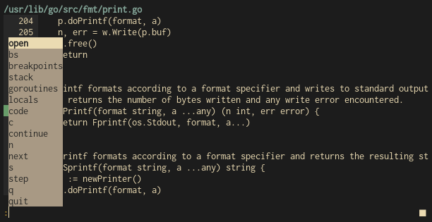

# dlv-tui

***dlv-tui*** is a terminal user interface for the [delve debugger](https://github.com/go-delve/delve). Made for Go developers who prefer using terminal-only tools in their workflow. The goal is to provide all functionality of the delve cli-debugger, wrapped in a TUI.

## Usage

The client supports debugging by running an excecutable or by attaching to an existing process.
The debug target is the first argument, after which the following options can be provided:

- `-attach` - If enabled, attach debugger to process. Interpret first argument as PID.
- `-port` - The port dlv rpc server will listen to. (default "8181")
- `-logfile` - Path to the log file. (default "$XDG_DATA_HOME/dlvtui.log")

## Configuration

Keybindings, colors and behavior of the client are customizable via a yaml configuration file located at `$XDG_CONFIG_HOME/dlvtui/config.yaml`.

Refer to `config.yaml` for an example configuration.
